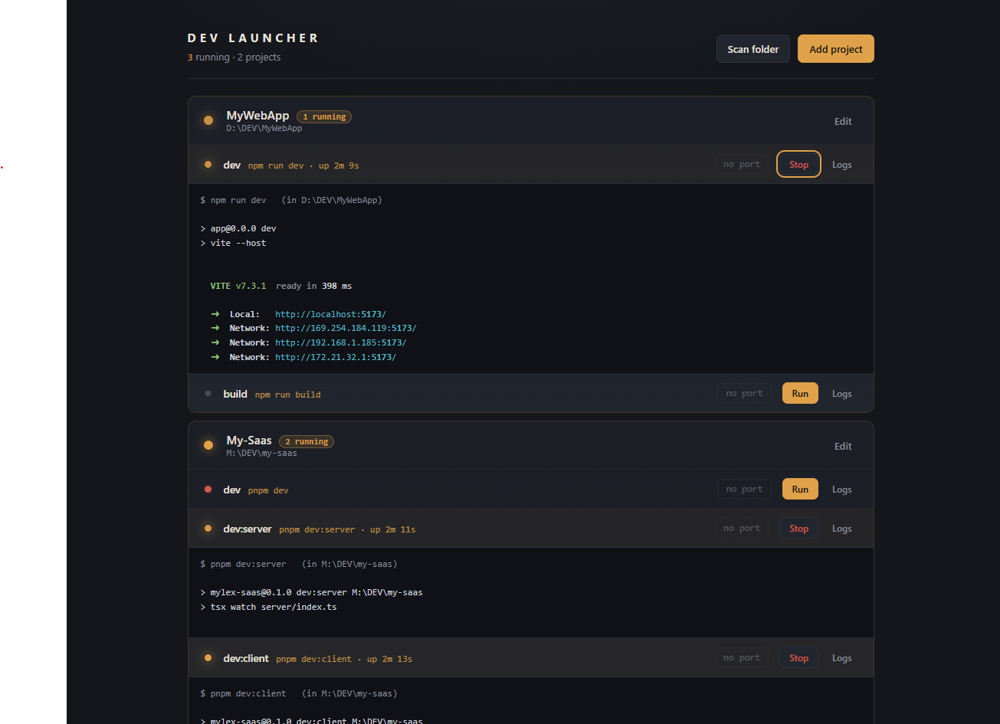

# Dev Launcher

A tiny local control panel for your scattered dev projects. One list, a Run/Stop
button per command, live logs, and port-conflict handling for when three projects
all want `:5173`.



## Run it

```bash
npm install
npm start
```

Then open **http://localhost:9000**. (Change with `PORT=9001 npm start`.)

The UI (React) is bundled locally with esbuild on startup — no CDN, so it works
offline. If you edit `public/app.jsx`, restart the server to rebuild the bundle.

## Use it

- **Projects & commands** — a project is a folder plus the commands you run in it.
  Add as many commands as you like (`npm run dev`, `dotnet run`, a raw script like
  `tsx watch server/index.ts`, …); each runs on its own with its own Run/Stop,
  port, and live log.
- **Add / Edit** — set name, folder, an optional category and tags, and the
  command list. **Remove** lives inside the Edit form.
- **Detect from folder** — reads the folder's `package.json` scripts (and any
  `.csproj`) and offers them as commands. It picks the right package manager
  automatically — npm / **pnpm** / **yarn** / **bun** — from the lockfile or the
  `packageManager` field, so you get `pnpm dev`, `bun run dev`, etc.
- **Scan folder** — point it at `C:\dev` and it finds every folder with a
  `package.json` or `.csproj` so you can bulk-add. Add more commands afterwards
  with Edit.
- **Run / Stop** — Run spawns the command in that folder; Stop kills the whole
  process tree (so `npm run dev` doesn't leave the real dev server orphaned).
  Quitting the launcher stops everything it started.
- **Port conflicts** — if a command's port is already taken, Run won't start
  blindly. You get "**:5173 — free it & run?**" and one click frees the port and
  starts it. Ports are per command, so a frontend on `:5173` and an API on `:3000`
  are tracked separately.
- **Logs** — live output per command, with ANSI colours rendered (Vite/Next
  output looks right, not raw escape codes). Re-running keeps the same log view.

### Organising

- **Favorite** ⭐ and **Hide** 👁 — toggle right on each card.
- **Category & tags** — a category pill plus `#tag` chips; click a tag to filter.
- **Filter bar** — tiny **All / Fav / Hidden** pills (with counts) up top, plus one
  pill per category. Hidden projects only show under **Hidden**.
- **Collapse / expand** — click a project header to fold its command list. The
  state is saved per project and survives refresh and restart.

Projects live in `registry.json` — plain text, edit it directly if you prefer.
Older single-command registries are migrated to the new command-list shape
automatically on startup.

## Notes for your setup

- **Force-free port** uses `netstat` + `taskkill` on Windows, `lsof` + `kill`
  elsewhere. No admin rights needed for your own processes.
- **COM/STA** Windows Services behave best as *real* services.
  For those, set the command to `sc start SageLink` (or `net start …`) instead of
  `dotnet run`, so the launcher just toggles the service.
- This is a dev tool with no auth. Keep it bound to localhost; don't expose it.
